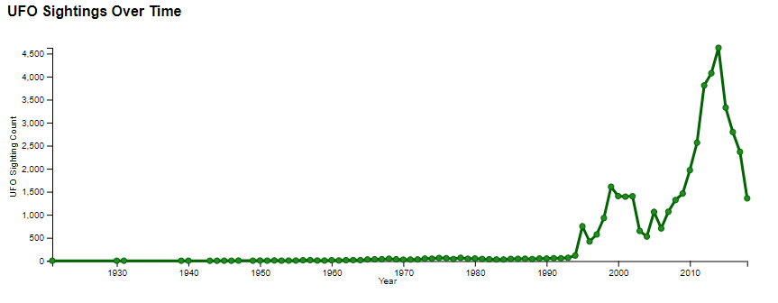
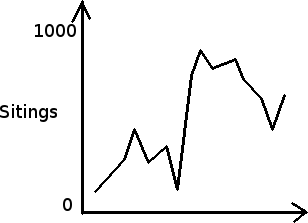
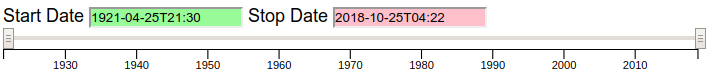
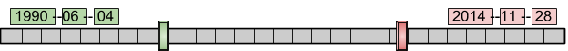

The Best Team

UFO Report Explorer

Project Process Document

------------------------------------------------------------------------

Project Proposal

Basic Information
==========================================

Project Title:  UFO Report Explorer
-----------------------------------------------------------------------------

Team Information:
------------------------------------------

<table>
<colgroup>
<col width="33%" />
<col width="33%" />
<col width="33%" />
</colgroup>
<tbody>
<tr class="odd">
<td>
Team Members:
</td>
<td>
Jonathon Pearson
</td>
<td>
Richard Scott McNew
</td>
</tr>
<tr class="even">
<td>
Email Addresses:
</td>
<td>
jnewellpearson@gmail.com
</td>
<td>
richard.scott.mcnew@gmail.com
</td>
</tr>
<tr class="odd">
<td>
A Numbers:
</td>
<td>
A01108018
</td>
<td>
A02077329
</td>
</tr>
</tbody>
</table>

Project Git Repository:
------------------------------------------------

https://github.com/rmcnew/TheBestTeamProject

Background and Motivation
--------------------------------------

Q:  Discuss your motivations and reasons for choosing this project, especially any background or research interests that may have influenced your decision.

A:  Have you ever wondered if we are not alone in the universe?  Could there be visitors from other worlds who are watching?  We know that the truth is out there.  By analyzing UFO sighting data from the National UFO Reporting Center and creating visualizations from the data we hope to show trends and find answers to help discover the truth.  The UFO sighting data is interesting, mysterious, and fun to examine, scrutinize, and explore.

Project Objectives
-------------------------------------------

Q:  Provide the primary questions you are trying to answer with your visualization. What would you like to learn and accomplish? List the benefits.

A:  Are there patterns in UFO sightings by time, location, duration, or UFO shape?  If so, what are the patterns and what might they indicate?  For example, do multiple sightings in a short time period in a small geographic area indicate a single event with multiple observers?  Do sightings with the same characteristics reoccur in different places or in the same place periodically?  What, if any, characteristics are common to the UFO sightings?  Do any UFO sightings happen during daylight hours?

Data
-----------------------------

Q:  From where and how are you collecting your data? If appropriate, provide a link to your data sources.

A:  Our data comes from the National UFO Reporting Center (NUFORC) http://www.nuforc.org/webreports.html

Data Processing
----------------------------------------

Q:  Do you expect to do substantial data cleanup? What quantities do you plan to derive from your data? How will data processing be implemented?

A:  Yes, we will need to clean up the data.  The NUFORC data will need to be cleaned up to remove test data and format it in CSV or JSON format for use in D3.js visualizations.  The data retrieval will be performed by the wget command line tool.  Data clean up and formatting will be handled with custom Perl scripts.  (The Perl scripts will be placed in our GitHub repository.)  There is basic location data for most of the UFO sightings, but it is given as "city, state" or "city, country".  The basic location data will be cross referenced with GIS data to get approximate latitude, longitude data for use in map plots.  Data visualizations will then be built from the clean, formatted, cross-referenced data.

Visualization Design
---------------------------------------------

Q:  How will you display your data? Provide some general ideas that you have for the visualization design. Develop three alternative prototype designs for your visualization. Create one final design that incorporates the best of your three designs. Describe your designs and justify your choices of visual encodings. We recommend you use the Five Design Sheet Methodology.

A:  We will display the data on a website, perhaps with a Google Maps component.

### General Ideas

We would like to ensure that our location data is displayed using a map.  The map may be a D3.js drawn map or a Google Maps overlay.  We also want to have one or more line / bar charts that show summary information across different dimensions of the represented data.  For example, there could be a line chart that shows the number of UFO sightings over a given time period and a bar chart that shows the shapes of the UFOs sighted.  

The controls should be simple and fairly intuitive to use.  They should facilitate exploration of the data and make it easy to find trends and to "drill-down" to get all of the details of a particular UFO sighting.  We could use mouse-based drag-to-select or brushing to allow the user to focus on an area of interest.  Checkboxes or radio buttons on a side control panel might also be an easy way for users to filter the data.

### Prototype Concept One

Prototype Concept One places the control panels on the left and the narrative / detail box in the middle between the map and line graphs.  The map and line graph are about equal in size so that both can be studied and used to select and explore the data.

------------------------------------------------------------------------

### Prototype Concept Two

Prototype Concept Two puts a timeline selector on the top and uses a larger map compared to smaller line and bar graphs.  The narrative / detail pane is on the right side, giving the map the center of attention and focus.  

------------------------------------------------------------------------

### 

### Prototype Concept Three

Prototype Concept Three takes the map focus to an extreme.  The date / timeline control is below the map along with miniature line and bar charts and other controls.  The detail / narrative panel takes up the entire right panel, allowing for multiple event details to be displayed at once and still remain out of the way.

### Prototype Concept Four

Prototype Four allows four filtering results based on geographical regions and and time.  As you Zoom in on the map it will filter the results for the line graph.  Also you have the ability to hover over a point to get more details including the description of the sighting.

### Prototype Concept Five

Prototype Five for different ways to view the data.  There is a timeline at the top showing sightings over time as a line graph.  The map shows where the sightings were reported, if one region has many events, the radius is made large.  The section to the left shows different attributes shown in a chart that makes sense for the attribute. You can also select a sighting in the map and get more details listed below.

------------------------------------------------------------------------

### 

### Prototype Concept Six

Prototype Six combines ideas from Prototypes Two, Four, and Five.  All controls are linked so that the same data is displayed on multiple visualization elements at once.  Dragging / brushing and holding down Control and clicking on UFO sighting events allows the user to select multiple events.  

Selected events are highlighted on the map and in the Detail Panel.  Clicking on one or more events in the detail panel highlights the respective points on the map and line graphs.  The Shape Checkbox controls on the top right allow the user to filter events by UFO shape.  It might also make sense to add a control / filter for the duration of the UFO sighting.  Perhaps we could add a keyword search to the Detail Panel if it is not too difficult (an optional feature).

### Detailed Design / Description of Components

Date Slider Concept

1950              1975                      1990           2000          2004                             2014                  2016                 2018

        The date slider will allow for selecting and filtering a given date range.  When selected, the other charts will filter their results based on the selection.

Map

### 

        The map will show points for each of the reported sightings.  If one particular area has more sighting than another, they will be shown with a larger radius.  As you hover over a data point, a brief description of the event will pop up. If there is more than one dataitem associated with a point, the description will show the count of how many events are associated with it.  Also, you can use the selection tool to filter the data shown in the other charts.

Line Chart

        1990        2000        2010        2018        

        

        The line chart will show how many sightings were reported at a given time.  This chart will be affected by the selection of the area on the map and the date range from the date selector.

Bar Chart

        This barchart will show the count of the different shape types that were reported in the dataset.  This chart will be affected by the date selector and the points selected on the map.

Detail Panel                

### 

### Final Design Concept

The Final Design will be based on Prototype Six.  We will make adjustments as needed based on the size and quality of the dataset.

Must-Have Features
-------------------------------------------

Q:  List the features without which you would consider your project to be a failure.

A:  UFO Sightings plotted on maps with filters to show by time ranges and UFO type.  Line / bar graphs that number of UFO sightings over time and UFO type.  The map and charts should be linked with common controls so that the same data is displayed on all visualization elements.  

Optional Features
------------------------------------------

Q:  List the features which you consider to be nice to have, but not critical.

A:  It would be nice to also show any time delays between when a UFO sighting occurred and when the UFO sighting was reported.  A long time delay between the occurrence and report might raise questions about the validity of the details and why the report was not made earlier.

We might also want to add narrative search capabilities for the UFO sighting events if there is time and it is not too difficult.

Project Schedule
-----------------------------------------

Q:  Make sure that you plan your work so that you can avoid a big rush right before the final project deadline, and delegate different modules and responsibilities among your team members.  Write this in terms of weekly deadlines.

A:  Tentative Project Schedule

<table>
<colgroup>
<col width="25%" />
<col width="25%" />
<col width="25%" />
<col width="25%" />
</colgroup>
<tbody>
<tr class="odd">
<td>
Due Out Item
</td>
<td>
Due Date
</td>
<td>
Description / Notes
</td>
<td>
Assigned To:
</td>
</tr>
<tr class="even">
<td>
Project Proposal
</td>
<td>
November 5
</td>
<td>
This document
</td>
<td>
Both
</td>
</tr>
<tr class="odd">
<td>
Data Extraction
</td>
<td>
November 6
</td>
<td>
Download all data from NUFORC website and extract to CSV or JSON
</td>
<td>
Scott
</td>
</tr>
<tr class="even">
<td>
Cross reference geographic locations to latitude, longitude pairs
</td>
<td>
November 7
</td>
<td>

</td>
<td>
Scott
</td>
</tr>
<tr class="odd">
<td>
Build map panel
</td>
<td>
November 12
</td>
<td>

</td>
<td>
Jonathon
</td>
</tr>
<tr class="even">
<td>
Plot sighting locations on map
</td>
<td>
November 15
</td>
<td>

</td>
<td>
Jonathon
</td>
</tr>
<tr class="odd">
<td>
Build line chart panel
</td>
<td>
November 18
</td>
<td>

</td>
<td>
Scott
</td>
</tr>
<tr class="even">
<td>
Project Prototype
</td>
<td>
November 19
</td>
<td>
https://usu.instructure.com/courses/516435/assignments/2536774
</td>
<td>
Both
</td>
</tr>
<tr class="odd">
<td>
Link all visualization elements
</td>
<td>
November 22
</td>
<td>

</td>
<td>
Both
</td>
</tr>
<tr class="even">
<td>
Polish User Interface
</td>
<td>
November 26
</td>
<td>

</td>
<td>
Both
</td>
</tr>
<tr class="odd">
<td>
Project Final Submission
</td>
<td>
November 30
</td>
<td>
https://usu.instructure.com/courses/516435/assignments/2536776
</td>
<td>
Both
</td>
</tr>
</tbody>
</table>

------------------------------------------------------------------------

Project Prototype

Basic Information
==========================================

Project Title:  UFO Report Explorer
-----------------------------------------------------------------------------

Team Information:
------------------------------------------

<table>
<colgroup>
<col width="33%" />
<col width="33%" />
<col width="33%" />
</colgroup>
<tbody>
<tr class="odd">
<td>
Team Members:
</td>
<td>
Jonathon Pearson
</td>
<td>
Richard Scott McNew
</td>
</tr>
<tr class="even">
<td>
Email Addresses:
</td>
<td>
jnewellpearson@gmail.com
</td>
<td>
richard.scott.mcnew@gmail.com
</td>
</tr>
<tr class="odd">
<td>
A Numbers:
</td>
<td>
A01108018
</td>
<td>
A02077329
</td>
</tr>
</tbody>
</table>

Project Git Repository:
----------------------------------------------------

https://github.com/rmcnew/TheBestTeamProject

Background and Motivation:
-------------------------------------------------------

Q:  Provide an overview of the project goals and the motivation for it. Consider that this will be read by people who did not see your project proposal.

A:  Have you ever wondered if we are not alone in the universe?  Could there be visitors from other worlds who are watching?  We know that the truth is out there.  In fact there are many who have reported seeing unexplainable phenomena.   By analyzing UFO sighting data from the National UFO Reporting Center and creating visualizations from the data we hope to show trends and find answers to help discover the truth.  The UFO sighting data is interesting, mysterious, and fun to examine, scrutinize, and explore.  

Related Work: 
----------------------------------------------------------------

Q:  Anything that inspired you, such as a paper, a web site, visualizations we discussed in class, etc.

A:  UFOs are imagination fuel.  They inspired popular books, movies, and TV shows such as Close Encounters of the Third Kind, Independence Day, Men In Black, The X-Files, and many more.  Our UFO Report Explorer seeks to capture the imagination of UFO enthusiasts and the curious who want to know the truth.  

Questions: 
-------------------------------------------------------------

Q:  What questions are you trying to answer? How did these questions evolve over the course of the project? What new questions did you consider in the course of your analysis?

A:  Our UFO Report Explorer should allow interested users to delve into UFO sighting data and easily see trends and corroborate multiple UFO sighting reports to a single UFO event.  That is, we want to make it easy to find and highlight sightings that occurred within a certain location (X mile radius of a given UFO sighting) at a certain time (e.g. within one hour of a given UFO sighting).  We might also want to have ways for the user to filter and group by UFO shape too.  We could do this with a bottom-up clustering of some kind (e.g. Union Find algorithm) or perhaps with SQL queries on a Web SQL database that will hold the loaded UFO sighting report data.

We developed the initial set of questions by examining the UFO report data.  Each UFO report has fields that describe when the sighting occurred, where it occurred, what the UFO looked like, how long the UFO was seen, and a narrative of the event.  These data fields allowed us to find ways to filter, group, and aggregate the data to seek trends.
Upon further consideration and consultation with Dr. Edwards, we decided that it would be good to  create a word cloud or some kind of histogram for the narrative parts of the UFO sightings.  This might call out of of the interesting parts of the narratives for the user to explore.  We should definitely try to put in the narrative keyword search part of the UI.

Data: 
-----------------------------------

Q:  Source, scraping method, cleanup, etc.

A:  The raw data was scraped from the NUFORC web site using wget (https://www.gnu.org/software/wget/) with the following command:

wget -w 2 --random-wait -r -k -p http://www.nuforc.org/webreports/ndxevent.html

The raw data was approximately 2.1 gigabytes of Microsoft Frontpage-generated web pages.  The data took about two days to download due to the size of the data and our use of conservative web scraping parameters so as to not overtax the NUFORC web site.

The <a href="https://www.google.com/url?q=https://github.com/rmcnew/TheBestTeamProject/blob/master/data_extraction/extractReport.pl&amp;sa=D&amp;ust=1542850913465000" class="c4">extractReport.pl</a><a href="https://www.google.com/url?q=https://github.com/rmcnew/TheBestTeamProject/blob/master/data_extraction/extractReport.pl&amp;sa=D&amp;ust=1542850913465000" class="c4"> Perl script</a> was used to extract the useful fields from each report web page and write it to a pipe (|) delimited text file.

The pipe delimited text file was opened in the vim text editor and regular expressions were used to find and delete all reports occurring outside the United States. 

A “city, state” to “latitude, longitude” lookup was performed using the <a href="https://www.google.com/url?q=https://github.com/rmcnew/TheBestTeamProject/blob/master/data_extraction/latLongLookup.pl&amp;sa=D&amp;ust=1542850913466000" class="c4">latLongLookup.pl</a><a href="https://www.google.com/url?q=https://github.com/rmcnew/TheBestTeamProject/blob/master/data_extraction/latLongLookup.pl&amp;sa=D&amp;ust=1542850913467000" class="c4"> Perl script</a> and the <a href="https://www.google.com/url?q=https://github.com/rmcnew/TheBestTeamProject/blob/master/data_extraction/lookupTable.csv&amp;sa=D&amp;ust=1542850913467000" class="c4">lookupTable.csv</a><a href="https://www.google.com/url?q=https://github.com/rmcnew/TheBestTeamProject/blob/master/data_extraction/lookupTable.csv&amp;sa=D&amp;ust=1542850913467000" class="c4"> file</a>.  (lookupTable.csv was derived from <a href="https://www.google.com/url?q=https://github.com/rmcnew/TheBestTeamProject/blob/master/data_extraction/uscitiesv1.4.csv&amp;sa=D&amp;ust=1542850913468000" class="c4">uscitiesv1.4.csv</a> which was downloaded from https://simplemaps.com/data/us-cities.)

The <a href="https://www.google.com/url?q=https://github.com/rmcnew/TheBestTeamProject/blob/master/data_extraction/dateTimeToIso.pl&amp;sa=D&amp;ust=1542850913469000" class="c4">dateTimeToIso.pl</a><a href="https://www.google.com/url?q=https://github.com/rmcnew/TheBestTeamProject/blob/master/data_extraction/dateTimeToIso.pl&amp;sa=D&amp;ust=1542850913469000" class="c4"> Perl script</a> was used to convert the UFO sighting occurrence datetime and UFO report datetime to a standard ISO 8601 format (YYYY-mm-ddTHH:MM).

The <a href="https://www.google.com/url?q=https://github.com/rmcnew/TheBestTeamProject/blob/master/data_extraction/normalizeDuration.pl&amp;sa=D&amp;ust=1542850913470000" class="c4">normalizeDuration.pl</a><a href="https://www.google.com/url?q=https://github.com/rmcnew/TheBestTeamProject/blob/master/data_extraction/normalizeDuration.pl&amp;sa=D&amp;ust=1542850913470000" class="c4">Perl script</a> was used to convert a myriad of UFO sighting durations to a standardized hour:minute:second (HH:MM:SS) format. 

Exploratory Data Analysis: 
-----------------------------------------------------------------------------

Q:  What visualizations did you use to initially look at your data? What insights did you gain? How did these insights inform your design?

A:  We initially examined the data on the NUFORC website itself.  This gave us an idea of the properties of individual UFO reports and some idea of what might be possible with the data.  After the data was scraped from the NUFORC website and cleaned up, we viewed the collected data in a spreadsheet.

Although we did not use any visualization tools to look at the data, we saw that the source data was not well organized on the NUFORC website and might contain trends and other groupings that good data visualizations could bring to light.

The insights we gained by examining the data helped us to brainstorm the six prototype designs submitted in the project proposal.

Design Evolution: 
--------------------------------------------------------------------

Q:  What are the different visualizations you considered? Justify the design decisions you made using the perceptual and design principles you learned in the course. Did you deviate from your proposal?

A:  The different visualization designs we considered are given in the Project Proposal portion of this document above.  

One major aspect of our visualization is the use of a map of the United States with a time selection tool to show where sightings have taken place. We have done this because one of the the main questions we have is how many sightings that were experienced by many people.  Having our data viewable on a map and viewable by date will make it easier to see when and where large groups of people saw something similar.  This gives us the ability to analyze the data and see whether there is knowledge to be gained by comparing the descriptions from multiple witnesses.

The map will also include the ability to select UFO sightings by geographic location by drag clicking a rectangle or by selecting multiple individual points by mouse click.  This allows areas of interest to be defined that can be further examined and explored.

We also plan to use line graphs and histograms to show aggregate values for the selected and filtered data.  This will make it easy to see how many sightings occurred for a given time range and geography and focus exploration to corroborate multiple witness for a single UFO sighting event.

We have not deviated from our proposal design so far.  We will probably add text search capabilities for the UFO sighting narratives and possibly other ways to explore the narratives if time permits.

Implementation: 
------------------------------------------------------------------

Q:  Describe the intent and functionality of the interactive visualizations you implemented. Provide clear and well-referenced images showing the key design and interaction elements.

A:  We are using the following interactive elements:  Date Selector, UFO Shape Selector, Map Selector, and Narrative Details.  

The Date Selector allows for filtering results by a given date range:

It uses two overlaid range slider inputs and matching date input text fields to allow the user to quickly select a date range to filter the UFO sighting report data.  Dragging either slider causes the date shown in the respective date field to update.  Typing in a date directly into the date field also works and causes the respective slider to jump to the indicated position on the timeline.

The UFO Shape Selector is a set of checkboxes that show what kind of UFO shapes will be present in the selected data:

By checking or unchecking each UFO shape's checkbox, the user can limit the data displayed on the Map, Line and Histogram Charts, and the Narrative Details panel.

The Map Selector plays a dual role to both display the geographic locations of UFO sightings and select one or more UFO sightings of interest:

On this prototype screenshot, each dot on the map represents an individual UFO sighting.  However, we are exploring other ways to display the map data as well such as a heat map or weighted dots that vary in size or hue for more UFO sightings at a given location.  We also would like to implement map zooming so that the user see more geographic details and select locations with greater precision.

The Narrative Details panel gives the narrative account provided by the eyewitness who submitted the UFO sighting report.  The narratives vary considerably in length, quality, and usefulness.  Due to the sheer size of the dataset, it is not easy to manually or programmatically find and discard less useful narratives.  Nevertheless, providing the user with an easy way to search through the narratives is important and we plan to implement a basic word search functionality so that narratives of interest can be discovered and displayed on the shown on the map and charts.  

The prototype Narrative Details shown here helped us to better understand how difficult it could be for a user to examine this data and the performance impact of loading 43,000 data entries (22 MB) into our UFO Report Explorer web page.  We will probably need to use Web Workers or some other technique to parallelize the loading of data to improve the performance of our visualizations.

Evaluation: 
--------------------------------------------------------------

Q:  What did you learn about the data by using your visualizations? How did you answer your questions? How well does your visualization work, and how could you further improve it?

A:  We are still in the process of building our visualizations and have learned how to scrape, extract, clean, filter and normalize a fairly large dataset from 2.1 GB of raw data to 22 MB of ready-to-use data (more than 43,000 entries).  We have been learning how to efficiently organize and filter the dataset using Web SQL so that our data visualizations are performant and the user interfaces are easy for users to understand and use to explore the data.

We are still working on building the visualizations so that our questions can be answered to easily show corroborated UFO sightings with multiple eyewitness accounts.

Our visualization does not work very well yet, it is still a work in progress.  We are working on building out all of the features in our original design as well as the improvements recommended by Dr. Edwards.
