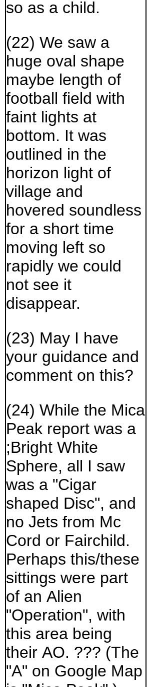
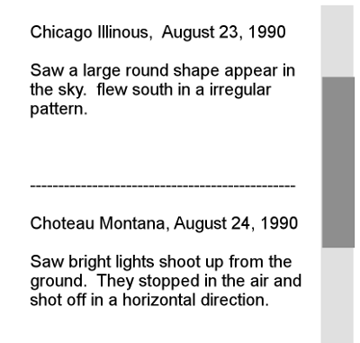

Project
Proposal

# Basic Information

## Project Title:  UFO Report Explorer

## Team Information:

|                                           |                                                  |                                                       |
| ----------------------------------------- | ------------------------------------------------ | ----------------------------------------------------- |
| Team Members:    | Jonathon Pearson         | Richard Scott McNew           |
| Email Addresses: | jnewellpearson@gmail.com | richard.scott.mcnew@gmail.com |
| A Numbers:       | A01108018                | A02077329                     |

## Project Git Repository:

https://github.com/rmcnew/TheBestTeamProject

## Background and Motivation

Q:  Discuss your motivations and reasons for choosing
this project, especially any background or research interests that may
have influenced your decision.  

A:  Have you ever wondered if we are not alone in the
universe?  Could there be visitors from other worlds who are watching?
 We know that the truth is out there.  By analyzing UFO sighting data
from the National UFO Reporting Center and creating visualizations from
the data we hope to show trends and find answers to help discover the
truth.  The UFO sighting data is interesting, mysterious, and fun to
examine, scrutinize, and explore.

## Project Objectives

Q:  Provide the primary questions you are trying to
answer with your visualization. What would you like to learn and
accomplish? List the benefits.  

A:  Are there patterns in UFO sightings by time,
location, duration, or UFO shape?  If so, what are the patterns and what
might they indicate?  For example, do multiple sightings in a short time
period in a small geographic area indicate a single event with multiple
observers?  Do sightings with the same characteristics reoccur in
different places or in the same place periodically?  What, if any,
characteristics are common to the UFO sightings?  Do any UFO sightings
happen during daylight hours?

## Data

Q:  From where and how are you collecting
your data? If appropriate, provide a link to your data sources.  

A:  Our data comes from the National UFO Reporting
Center (NUFORC) http://www.nuforc.org/webreports.html

## Data Processing

Q:  Do you expect to do substantial data
cleanup? What quantities do you plan to derive from your data? How will
data processing be implemented?  

A:  Yes, we will need to clean up the data.  The NUFORC
data will need to be cleaned up to remove test data and format it in CSV
or JSON format for use in D3.js visualizations.  The data retrieval will
be performed by the wget command line tool.  Data clean up and
formatting will be handled with custom Perl scripts.  (The Perl scripts
will be placed in our GitHub repository.)  There is basic location data
for most of the UFO sightings, but it is given as "city, state" or
"city, country".  The basic location data will be cross referenced with
GIS data to get approximate latitude, longitude data for use in map
plots.  Data visualizations will then be built from the clean,
formatted, cross-referenced data.

## Visualization Design

Q:  How will you display your data?
Provide some general ideas that you have for the visualization design.
Develop three alternative prototype designs for your visualization.
Create one final design that incorporates the best of your three
designs. Describe your designs and justify your choices of visual
encodings. We recommend you use the Five Design Sheet Methodology.  

A:  We will display the data on a website, perhaps with
a Google Maps component.

### General Ideas

We would like to ensure that our location data is
displayed using a map.  The map may be a D3.js drawn map or a Google
Maps overlay.  We also want to have one or more line / bar charts that
show summary information across different dimensions of the represented
data.  For example, there could be a line chart that shows the number of
UFO sightings over a given time period and a bar chart that shows the
shapes of the UFOs sighted.  

The controls should be simple and fairly intuitive to
use.  They should facilitate exploration of the data and make it easy to
find trends and to "drill-down" to get all of the details of a
particular UFO sighting.  We could use mouse-based drag-to-select or
brushing to allow the user to focus on an area of interest.  Checkboxes
or radio buttons on a side control panel might also be an easy way for
users to filter the
data.

### Prototype Concept One

Prototype Concept One places the control panels on the left and
the narrative / detail box in the middle between the map and line
graphs.  The map and line graph are about equal in size so that both can
be studied and used to select and explore the
data.

-----

### Prototype Concept Two

Prototype Concept Two puts a timeline selector on the
top and uses a larger map compared to smaller line and bar graphs.  The
narrative / detail pane is on the right side, giving the map the center
of attention and focus.
 

-----

### 

### Prototype Concept Three

Prototype Concept Three takes the map focus to an
extreme.  The date / timeline control is below the map along with
miniature line and bar charts and other controls.  The detail /
narrative panel takes up the entire right panel, allowing for multiple
event details to be displayed at once and still remain out of the
way.

### Prototype Concept Four

Prototype Four allows four filtering results based on
geographical regions and and time.  As you Zoom in on the map it will
filter the results for the line graph.  Also you have the ability to
hover over a point to get more details including the description of the
sighting.

### Prototype Concept Five

Prototype Five for different ways to view the data.
 There is a timeline at the top showing sightings over time as a line
graph.  The map shows where the sightings were reported, if one region
has many events, the radius is made large.  The section to the left
shows different attributes shown in a chart that makes sense for the
attribute. You can also select a sighting in the map and get more
details listed
below.

-----

### 

### Prototype Concept Six

Prototype Six combines ideas from Prototypes Two, Four,
and Five.  All controls are linked so that the same data is displayed on
multiple visualization elements at once.  Dragging / brushing and
holding down Control and clicking on UFO sighting events allows the user
to select multiple events.  

Selected events are highlighted on the map and in the
Detail Panel.  Clicking on one or more events in the detail panel
highlights the respective points on the map and line graphs.  The Shape
Checkbox controls on the top right allow the user to filter events by
UFO shape.  It might also make sense to add a control / filter for the
duration of the UFO sighting.  Perhaps we could add a keyword search to
the Detail Panel if it is not too difficult (an optional
feature).

### Detailed Design / Description of Components

Date Slider
Concept

1950              1975                      1990  
        2000          2004                             2014            
     2016                 2018

        The date slider will
allow for selecting and filtering a given date range.  When selected,
the other charts will filter their results based on the
selection.

Map

### 

        The map will show points for each of the reported
sightings.  If one particular area has more sighting than another, they
will be shown with a larger radius.  As you hover over a data point, a
brief description of the event will pop up. If there is more than one
dataitem associated with a point, the description will show the count of
how many events are associated with it.  Also, you can use the selection
tool to filter the data shown in the other charts.

Line
Chart

        1990        2000        2010        2018        

        

        The line chart will show how many sightings
were reported at a given time.  This chart will be affected by the
selection of the area on the map and the date range from the date
selector.

Bar
Chart

        This barchart will show the count of the
different shape types that were reported in the dataset.  This chart
will be affected by the date selector and the points selected on the
map.

Detail
Panel                

### 

### Final Design Concept

The Final Design will be based on Prototype Six.  We
will make adjustments as needed based on the size and quality of the
dataset.

## Must-Have Features

Q:  List the features without which you
would consider your project to be a failure.  

A:  UFO Sightings plotted on maps with filters to show
by time ranges and UFO type.  Line / bar graphs that number of UFO
sightings over time and UFO type.  The map and charts should be linked
with common controls so that the same data is displayed on all
visualization elements.  

## Optional Features

Q:  List the features which you consider
to be nice to have, but not critical.  

A:  It would be nice to also show any time delays
between when a UFO sighting occurred and when the UFO sighting was
reported.  A long time delay between the occurrence and report might
raise questions about the validity of the details and why the report was
not made earlier.

We might also want to add narrative search capabilities
for the UFO sighting events if there is time and it is not too
difficult.

## Project Schedule

Q:  Make sure that you plan your work so that you can
avoid a big rush right before the final project deadline, and delegate
different modules and responsibilities among your team members.  Write
this in terms of weekly deadlines.

A:  Tentative Project
Schedule

|                                                                                           |                                     |                                                                                          |                                      |
| ----------------------------------------------------------------------------------------- | ----------------------------------- | ---------------------------------------------------------------------------------------- | ------------------------------------ |
| Due Out Item                                                      | Due Date    | Description / Notes                                              | Assigned To: |
| Project Proposal                                                  | November 5  | This document                                                    | Both         |
| Data Extraction                                                   | November 6  | Download all data from NUFORC website and extract to CSV or JSON | Scott        |
| Cross reference geographic locations to latitude, longitude pairs | November 7  |                                                                  | Scott        |
| Build map panel                                                   | November 12 |                                                                  | Jonathon     |
| Plot sighting locations on map                                    | November 15 |                                                                  | Jonathon     |
| Build line chart panel                                            | November 18 |                                                                  | Scott        |
| Project Prototype                                                 | November 19 | https://usu.instructure.com/courses/516435/assignments/2536774   | Both         |
| Link all visualization elements                                   | November 22 |                                                                  | Both         |
| Polish User Interface                                             | November 26 |                                                                  | Both         |
| Project Final Submission                                          | November 30 | https://usu.instructure.com/courses/516435/assignments/2536776   | Both         |

